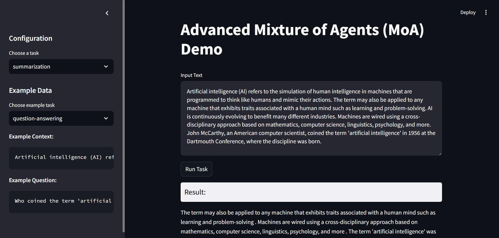

# MOA-NLP-Toolkit

## Click to View App

This will take you to Huggingface Space

## Overview

The MOA-NLP-Toolkit is an interactive web application built with Streamlit, designed to showcase the capabilities of advanced natural language processing (NLP) using a Mixture of Agents (MoA) approach. It integrates models from the Hugging Face Transformers library to perform tasks such as text summarization, question-answering, and text generation.

## Features

- **Summarization**: Automatically condenses long texts into concise summaries.
- **Question-Answering**: Provides accurate answers to user queries based on given contexts.
- **Text Generation**: Generates new text continuations based on user-provided prompts.

## Run

streamlit run MOA.py

## License

This project is licensed under the [MIT License](./LICENSE). See the LICENSE file for details.
